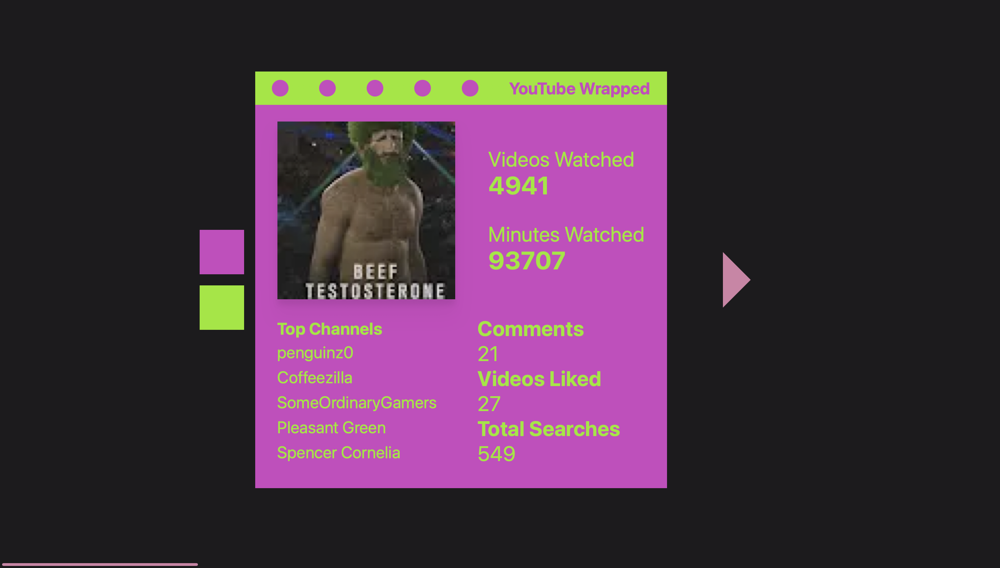

<div align="center">
<h1>YouTube Wrapped v2</h1>

<p> Generate a summary of your year on YouTube! <br/> 
 A second version focusing on user interactivity. </p>
<p> Built with Next.js, Tailwind CSS & Python.</p>


</div>


## Getting Started
#### Frontend
1. Navigate to the frontend folder.
2. Install the dependencies.
  ```npm install```
3. Start the development server.
  ```npm run dev```
4. View it at [http://localhost:3000](http://localhost:3000)

#### Backend
1. Navigate to the backend folder.
2. Install the dependancies.
  ```pip install -r requirements.txt```
3. Create a project & API key for https://console.cloud.google.com.
  (For YouTube Data v3 API)
4. Create a `.env` file. 
  ```DEVELOPER_KEY=YOUR_KEY```
5. Start the Flask server.
  ```python3 app.py```